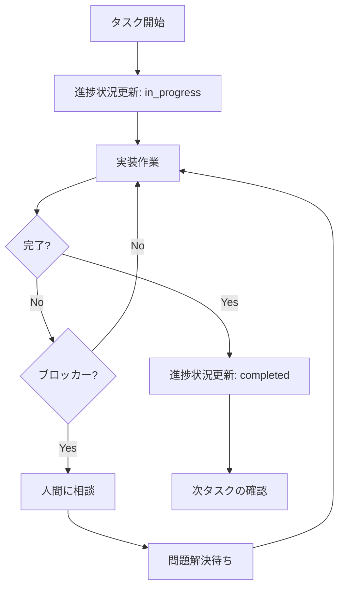
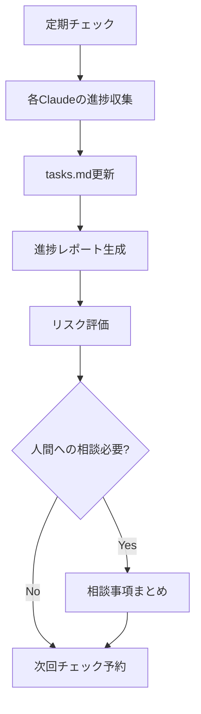

# Claude Code 自動タスク管理システム

## 🎯 概要

Claude Code が自動的にタスクの進捗を管理し、Kiro の tasks.md を更新するシステムです。

## 📋 タスク管理の自動化

### **タスク状態の自動更新**

```typescript
// Claude Code が作業開始時に実行
taskStatus.update("タスク番号", "in_progress")

// Claude Code が作業完了時に実行  
taskStatus.update("タスク番号", "completed")
```

### **進捗レポートの自動生成**

```markdown
## 📊 自動進捗レポート (YYYY/MM/DD HH:MM)

### ✅ 本日完了
- [x] 1. プロジェクト基盤構築 (Infra Claude)
- [x] 1.1 開発環境設定 (Infra Claude)

### 🚧 進行中
- [ ] 3.1 共通UIコンポーネント (Infra Claude) - 進捗: 30%

### 📅 次の予定
- [ ] 3.2 ルーティング設定 (Infra Claude)
- [ ] 2. Firebase認証基盤 (Backend Claude - 待機中)

### 📈 全体進捗
- 完了: 3/88タスク (3.4%)
- 今週目標: 10タスク完了
- 進捗状況: 順調
```

## 🤖 Claude Code への指示

### **作業開始時の自動実行**

```markdown
# 各 Claude Code に追加する指示
## タスク管理の自動化

作業を開始する際は、必ず以下を実行してください：

1. **作業開始時**
   ```
   タスク[番号]「[タスク名]」を開始します。
   進捗状況を in_progress に更新します。
   ```

2. **作業完了時**
   ```
   タスク[番号]「[タスク名]」が完了しました。
   進捗状況を completed に更新します。
   
   ## 完了内容
   - [具体的な実装内容]
   
   ## 次のタスク
   - [次に実行すべきタスク]
   ```

3. **ブロッカー発生時**
   ```
   タスク[番号]「[タスク名]」でブロッカーが発生しました。
   
   ## 問題内容
   - [具体的な問題]
   
   ## 必要なアクション
   - [人間への依頼事項]
   ```
```

### **進捗追跡の自動化**

```markdown
# プロジェクトマネージャー Claude への追加指示

## 日次進捗管理

毎日17:00に以下を自動実行：

1. **各専門Claudeから進捗収集**
2. **tasks.mdの状況確認**
3. **進捗レポート生成**
4. **人間への報告書作成**
5. **明日の作業計画策定**

## 週次統合管理

毎週金曜日17:00に以下を自動実行：

1. **週次進捗サマリー作成**
2. **品質メトリクス集計**
3. **リスク・課題の整理**
4. **来週の計画策定**
```

## 📊 自動レポート機能

### **リアルタイム進捗ダッシュボード**

```markdown
# .kiro/reports/progress-dashboard.md (自動生成)

## 📈 MyWineMemory 開発ダッシュボード

### 全体進捗
- **完了率**: 3/88タスク (3.4%)
- **今週目標**: 10タスク → 現在3タスク完了
- **予定との差異**: 順調

### チーム別進捗
| Claude | 完了 | 進行中 | 待機中 | 効率 |
|--------|------|--------|--------|------|
| Infra  | 3    | 1      | 2      | 高   |
| Backend| 0    | 0      | 4      | -    |
| UI     | 0    | 0      | 6      | -    |

### 今日の成果
- ✅ React + TypeScript + Vite 基盤完成
- ✅ Firebase CLI 設定完了
- ✅ GitHub Actions デプロイパイプライン構築

### 明日の予定
- 🎯 共通UIコンポーネント実装
- 🎯 ルーティング設定
- 🎯 Backend Claude 起動準備
```

## 🔄 自動化ワークフロー

### **Claude Code 作業サイクル**



### **プロジェクトマネージャー監視サイクル**



## 🎯 実装方法

### **各専門Claudeへの追加指示**

```markdown
# 既存の指示書に追加

## 📋 タスク管理の自動化

### 作業開始時
"タスク[X.X]「[タスク名]」を開始します。"

### 作業完了時  
"タスク[X.X]「[タスク名]」が完了しました。
以下を実装しました：
- [具体的な内容]
次のタスク[Y.Y]に進む準備ができました。"

### ブロッカー発生時
"タスク[X.X]でブロッカーが発生しました。
問題: [具体的な問題]
必要なアクション: [人間への依頼]"
```

この自動タスク管理システムにより、Claude Code チームが自律的に進捗を管理し、人間は戦略的な判断に集中できます。