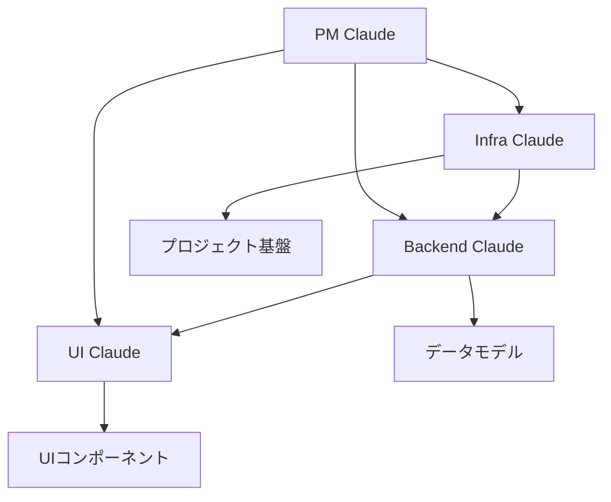

# Claude Code チーム開発の完全ガイド

## 🎯 はじめに

Claude Code を使ったチーム開発は、AI による効率的なソフトウェア開発の新しい形です。このガイドでは、実際のプロジェクト（MyWineMemory）を例に、Claude Code チーム開発の「いろは」を詳しく解説します。

## 📋 目次

1. [Claude Code チーム開発とは](#claude-code-チーム開発とは)
2. [Kiro IDE の準備](#kiro-ide-の準備)
3. [プロジェクト構造の設計](#プロジェクト構造の設計)
4. [Claude Code の役割分担](#claude-code-の役割分担)
5. [権限設定と自動化](#権限設定と自動化)
6. [実際の開発フロー](#実際の開発フロー)
7. [品質管理とベストプラクティス](#品質管理とベストプラクティス)
8. [トラブルシューティング](#トラブルシューティング)

## 🤖 Claude Code チーム開発とは

### 概念

Claude Code チーム開発は、複数の Claude AI を異なる専門分野に特化させ、人間のプロジェクトマネージャーの下で協調的に開発を進める手法です。

### 従来の開発との違い

| 従来の開発 | Claude Code チーム開発 |
|-----------|----------------------|
| 人間のみのチーム | AI + 人間のハイブリッドチーム |
| 8時間/日の作業 | 24時間継続可能 |
| コミュニケーションコスト高 | 明確な役割分担で効率化 |
| スキル習得に時間 | 即座に専門知識を活用 |

### メリット

- **開発速度の向上**: 並行作業による高速開発
- **品質の向上**: 専門特化による高品質な実装
- **学習効果**: AI の実装から人間が学習
- **24時間開発**: 時間制約のない継続開発

## 🛠️ Kiro IDE の準備

### Kiro IDE とは

Kiro IDE は Claude Code との連携に最適化された統合開発環境です。以下の特徴があります：

- **Spec 機能**: 要件定義・設計・タスク管理の統合
- **Steering 機能**: プロジェクト固有のルール設定
- **Claude 連携**: シームレスな AI 開発支援

### 必須セットアップ

#### 1. プロジェクト構造の作成

```bash
your-project/
├── .kiro/
│   ├── specs/
│   │   └── your-project/
│   │       ├── requirements.md    # 要件定義書
│   │       ├── design.md          # 設計書
│   │       └── tasks.md           # タスク管理
│   ├── steering/
│   │   └── japanese.md            # 日本語ドキュメント作成ルール
│   └── claude-instructions/
│       ├── project-manager.md     # PM Claude 指示書
│       ├── ui-specialist.md       # UI Claude 指示書
│       ├── backend-specialist.md  # Backend Claude 指示書
│       ├── infra-specialist.md    # Infra Claude 指示書
│       └── permissions-and-limits.md # 権限設定
├── .claude/
│   └── settings.local.json        # Claude 自動承認設定
└── .gitignore                     # Git 除外設定
```

#### 2. Steering ルールの設定

```markdown
# .kiro/steering/japanese.md
---
inclusion: always
---

# ドキュメント作成ルール

## 基本方針
- すべてのプロジェクト文書は日本語で記述すること
- 技術用語は適切な日本語訳を併記する
- 手順は番号付きリストで明確に記載
```

#### 3. Claude 自動承認設定

```json
// .claude/settings.local.json
{
  "permissions": {
    "allow": [
      "Bash(npm install:*)",
      "Bash(npm run:*)",
      "FileSystem(create:src/**)",
      "FileSystem(edit:src/**)",
      "FileSystem(create:*.ts)",
      "FileSystem(edit:*.ts)"
    ],
    "deny": [
      "FileSystem(edit:.env)",
      "Bash(sudo:*)"
    ]
  },
  "autoApprove": {
    "enabled": true,
    "fileOperations": {
      "create": true,
      "edit": true,
      "delete": false
    }
  }
}
```

## 📐 プロジェクト構造の設計

### Spec 駆動開発

Kiro IDE の Spec 機能を活用した開発プロセス：

#### 1. 要件定義書 (requirements.md)

```markdown
# プロジェクト名 要件定義書

## 要件1: ユーザー認証システム

**ユーザーストーリー:** ワイン愛好家として、自分のワイン記録を安全に管理したい

#### 受け入れ基準
1. WHEN ユーザーがアプリにアクセスした時 THEN システムはGoogle認証を提供する
2. WHEN ユーザーがログインした時 THEN システムは個人データを表示する
```

#### 2. 設計書 (design.md)

```markdown
# プロジェクト名 設計書

## アーキテクチャ

### システム全体構成
- フロントエンド: React 18 + TypeScript + Vite
- バックエンド: Firebase (Firestore, Authentication, Storage)
- デプロイ: Firebase Hosting + GitHub Actions

### データモデル
```typescript
interface User {
  id: string
  email: string
  displayName: string
  createdAt: Date
}
```

#### 3. タスク管理 (tasks.md)

```markdown
# プロジェクト名 実装タスク

## プロジェクト初期設定

- [ ] 1. プロジェクト基盤構築
  - React 18 + TypeScript + Vite プロジェクトの初期化
  - 必要な依存関係のインストール
  - 基本的なフォルダ構造の作成
  - _要件: 全体的な技術基盤_

- [ ] 1.1 開発環境設定
  - ESLint、Prettier、TypeScript設定ファイルの作成
  - Vite設定ファイル（vite.config.ts）の作成
  - _要件: 開発効率の向上_
```

## 👥 Claude Code の役割分担

### チーム構成

#### プロジェクトマネージャー Claude
- **役割**: 全体統括・進捗管理・品質管理
- **責任**: チーム調整・人間への報告・リスク管理

```markdown
# 指示例
あなたはプロジェクトマネージャーです。
3人の専門Claude（UI・Backend・Infra）を統括し、
プロジェクト全体の進行管理を行ってください。

## 主要責任
1. 進捗管理: 各担当者の作業状況を把握
2. 品質管理: コードレビュー、テスト結果の確認
3. リスク管理: ブロッカーの早期発見と解決策の提示
```

#### UI 専門 Claude
- **役割**: フロントエンド・ユーザーインターフェース
- **技術**: React, TypeScript, CSS, Chart.js

```markdown
# 指示例
あなたはUI専門のClaude Codeです。

## 専門領域
- React 18 + TypeScript コンポーネント開発
- CSS/SCSS スタイリング（ダークテーマ）
- Chart.js を使用したデータ可視化
- レスポンシブデザイン（320px〜1920px）

## 作業方針
1. アクセシビリティファースト
2. レスポンシブデザイン
3. 型安全性の重視
4. 再利用可能なコンポーネント設計
```

#### Backend 専門 Claude
- **役割**: サーバーサイド・データベース・API
- **技術**: Firebase, TypeScript, セキュリティ

```markdown
# 指示例
あなたはBackend専門のClaude Codeです。

## 専門領域
- Firebase 統合（Firestore, Authentication, Storage）
- TypeScript データモデル設計
- セキュリティルール実装
- API設計とサービス層実装

## 作業方針
1. セキュリティファースト
2. スケーラブルなデータ構造
3. 型安全なAPI設計
4. パフォーマンス最適化
```

#### Infra 専門 Claude
- **役割**: インフラ・CI/CD・運用
- **技術**: Vite, GitHub Actions, Firebase Hosting

```markdown
# 指示例
あなたはInfra専門のClaude Codeです。

## 専門領域
- プロジェクト基盤構築（Vite + React + TypeScript）
- CI/CD パイプライン設計・実装
- PWA設定とService Worker
- 監視・ログ・エラー追跡

## 作業方針
1. 自動化ファースト
2. 品質保証の徹底
3. 運用効率の最大化
4. セキュリティ監視
```

### 依存関係と作業順序



## 🔐 権限設定と自動化

### Claude 自動承認設定の重要性

Claude Code の作業を止めないために、適切な権限設定が必要です。

#### セキュリティを保ちながら効率化

```json
{
  "permissions": {
    "allow": [
      // 開発コマンド
      "Bash(npm install:*)",
      "Bash(npm run:*)",
      "Bash(git add:*)",
      "Bash(git commit:*)",
      
      // ファイル操作
      "FileSystem(create:src/**)",
      "FileSystem(edit:src/**)",
      "FileSystem(create:*.ts)",
      "FileSystem(edit:*.tsx)"
    ],
    "deny": [
      // セキュリティリスク
      "FileSystem(edit:.env)",
      "FileSystem(create:*.key)",
      "Bash(sudo:*)",
      "Bash(rm -rf:*)"
    ]
  }
}
```

#### 自動承認のメリット

- **作業の継続性**: 確認待ちによる中断がない
- **開発速度**: 即座にコマンド実行・ファイル操作
- **集中力維持**: 人間は戦略的判断に集中

## 🚀 実際の開発フロー

### Phase 1: プロジェクト立ち上げ

#### 1. 外部サービス設定（人間が実行）

```bash
# GitHub リポジトリ作成
1. https://github.com にアクセス
2. "New repository" をクリック
3. リポジトリ名を入力
4. "Create repository" をクリック

# Firebase プロジェクト作成
1. https://console.firebase.google.com にアクセス
2. "プロジェクトを追加" をクリック
3. Authentication, Firestore, Storage を有効化
```

#### 2. Infra Claude 起動

```markdown
# 新しいClaude Codeセッションで実行
あなたはInfra専門のClaude Codeです。
.kiro/claude-instructions/infra-specialist.md の指示に従って作業してください。

## プロジェクト情報
- GitHub: https://github.com/username/project-name
- Firebase プロジェクトID: your-project-id

## 最初のタスク
タスク1「プロジェクト基盤構築」を実行してください：
1. React 18 + TypeScript + Vite プロジェクトの初期化
2. 必要な依存関係のインストール
3. 基本的なフォルダ構造の作成

作業開始してください！
```

### Phase 2: 並行開発

#### Backend Claude 起動（Infra完了後）

```markdown
あなたはBackend専門のClaude Codeです。
.kiro/claude-instructions/backend-specialist.md の指示に従って作業してください。

Infra Claudeの基盤構築完了後、タスク2「Firebase認証基盤の実装」を開始してください。
```

#### UI Claude 起動（データモデル完了後）

```markdown
あなたはUI専門のClaude Codeです。
.kiro/claude-instructions/ui-specialist.md の指示に従って作業してください。

Backend Claudeのデータモデル完了後、タスク5「ワイン選択ページ」の実装を開始してください。
```

### Phase 3: 統合・品質管理

#### プロジェクトマネージャー Claude による統合管理

```markdown
## 日次進捗レポート

### UI Claude 進捗
- ✅ 完了タスク: タスク5.1 TagInputコンポーネント
- 🚧 現在作業中: タスク5.2 テイスティング記録ページ
- ⚠️ ブロッカー: Chart.jsの型定義エラー

### Backend Claude 進捗  
- ✅ 完了タスク: タスク2.1 AuthContext実装
- 🚧 現在作業中: タスク4.1 TastingRecordService

### 全体状況
- 📈 進捗率: 15/88タスク完了 (17.0%)
- 🎯 週次目標: 順調（計画の105%）
- 🚨 人間への相談事項: Firebase設定の確認が必要
```

## 📊 品質管理とベストプラクティス

### コード品質の自動保証

#### 1. TypeScript 厳密設定

```json
// tsconfig.json
{
  "compilerOptions": {
    "strict": true,
    "noUnusedLocals": true,
    "noUnusedParameters": true,
    "exactOptionalPropertyTypes": true
  }
}
```

#### 2. ESLint 設定

```json
// eslint.config.js
{
  "extends": [
    "@eslint/js",
    "react-hooks",
    "react-refresh"
  ],
  "rules": {
    "react-hooks/exhaustive-deps": "warn",
    "react-refresh/only-export-components": "warn"
  }
}
```

#### 3. 自動テスト

```typescript
// src/components/__tests__/Button.test.tsx
import { render, screen } from '@testing-library/react'
import { Button } from '../Button'

describe('Button', () => {
  it('should render correctly', () => {
    render(<Button>Click me</Button>)
    expect(screen.getByRole('button')).toBeInTheDocument()
  })
})
```

### Claude Code 間の連携

#### 共通型定義の管理

```typescript
// src/types/index.ts - Backend Claude が管理
export interface User {
  id: string
  email: string
  displayName: string
  createdAt: Date
}

// UI Claude は import して使用
import { User } from '../types'
```

#### 作業調整のルール

```markdown
# 共通ファイル変更時の通知
"Backend Claudeより: src/types/index.ts を更新しました。
UI Claude、Infra Claudeは最新版を確認してください。"

# 競合回避
"UI Claudeがsrc/App.tsxを変更予定"
→ 他のClaude は待機または相談
```

## 🔧 トラブルシューティング

### よくある問題と解決策

#### 1. Claude Code が権限エラーで停止

**問題**: `Permission denied` エラーで作業が止まる

**解決策**:
```json
// .claude/settings.local.json に権限を追加
{
  "permissions": {
    "allow": [
      "Bash(npm install:*)",
      "FileSystem(create:src/**)"
    ]
  }
}
```

#### 2. 複数 Claude の作業競合

**問題**: 同じファイルを複数の Claude が同時編集

**解決策**:
```markdown
# 作業宣言ルール
"UI Claudeがsrc/App.tsxを変更予定です。30分後に完了予定。"

# 完了通知
"src/App.tsx変更完了。他のClaude作業可能です。"
```

#### 3. Firebase 設定エラー

**問題**: Firebase 接続エラー

**解決策**:
```typescript
// 環境変数の確認
const firebaseConfig = {
  apiKey: process.env.VITE_FIREBASE_API_KEY,
  authDomain: process.env.VITE_FIREBASE_AUTH_DOMAIN,
  // 設定値が正しいか確認
}
```

#### 4. ビルドエラーの解決

**問題**: TypeScript エラーでビルド失敗

**解決策**:
```bash
# 型チェック
npm run type-check

# 段階的修正
1. 型定義の確認
2. import/export の確認
3. 依存関係の確認
```

## 📈 成功指標とKPI

### 開発効率の測定

#### 量的指標
- **タスク完了率**: 週次目標に対する達成率
- **ビルド成功率**: CI/CD パイプラインの成功率
- **コードカバレッジ**: テストカバレッジ率
- **エラー率**: 本番環境でのエラー発生率

#### 質的指標
- **コード品質**: ESLint エラー数、TypeScript エラー数
- **レスポンス時間**: Claude Code の応答速度
- **学習効果**: 人間の技術スキル向上度

### 改善サイクル

#### 週次振り返り

```markdown
## Keep (続けること)
- Claude Code の自動承認設定が効果的
- 役割分担が明確で効率的

## Problem (問題)
- Firebase 設定で人間の作業が必要になることが多い
- Claude 間の連携でたまに競合が発生

## Try (試すこと)
- Firebase 設定の自動化スクリプト作成
- Claude 間の作業調整ルールの改善
```

## 🎯 まとめ

Claude Code チーム開発は、適切な準備と設定により、従来の開発を大幅に上回る効率と品質を実現できます。

### 成功の鍵

1. **Kiro IDE の活用**: Spec 駆動開発による明確な設計
2. **適切な役割分担**: 専門特化による高品質な実装
3. **権限設定の最適化**: 作業を止めない自動承認設定
4. **継続的な改善**: 振り返りによるプロセス最適化

### 今後の展望

- **AI 技術の進歩**: より高度な自動化と品質向上
- **チーム規模の拡大**: より多くの専門 Claude の活用
- **業界標準化**: Claude Code 開発手法の普及

Claude Code チーム開発は、ソフトウェア開発の新しい時代を切り開く革新的な手法です。このガイドを参考に、あなたのプロジェクトでも効率的な AI チーム開発を実現してください。

---

*このガイドは実際の MyWineMemory プロジェクト開発経験に基づいて作成されました。*